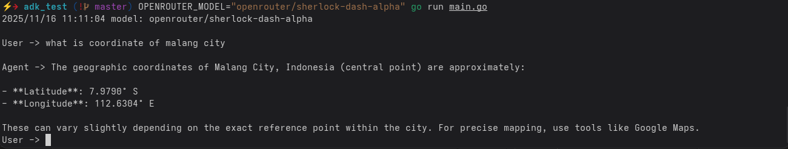

## Google ADK Test

This project experiments with OpenAI-compatible APIs, such as [OpenRouter](https://openrouter.ai).

### Getting Started

1. Create an account at [openrouter.ai](https://openrouter.ai).
2. Generate your API key.
3. Set the following environment variables in your configuration:
    ```env
    OPENROUTER_API_KEY=your_api_key_here
    OPENROUTER_MODEL=your_model_name_here
    ```

### Example


